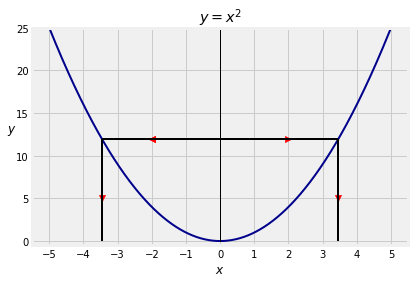

## Two-to-One Functions

Let $X$ have density $f_X$. As you have seen, the random variable $Y = X^2$ comes up frequently in calculations. Thus far, all we have needed is $E(Y)$ which can be found by the formula for the expectation of a non-linear function of $X$. To find the density of $Y$, we can't directly use the change of variable formula of the previous section because the function $g(x) = x^2$ is not monotone. It is two-to-one because both $\sqrt{x}$ and $-\sqrt{x}$ have the same square.

In this section we will find the density of $Y$ by developing a modification of the change of variable formula for the density of a monotone function of $X$. The modification extends in a straightforward manner to other two-to-one functions and also to many-to-one functions.

### Density of $Y = X^2$
If $X$ can take both positive and negative values, we have to account for the fact that there are two mutually exclusive ways in which the event $\{ Y \in dy \}$ can happen: either $X$ has to be near the positive square root of $y$ or near the negative square root of $y$.

So the density of $Y$ at $y$ has two components, as follows. For $y > 0$,

$$
f_Y(y) ~ = ~ a + b
$$

where

$$
a = \frac{f_X(x_1)}{2x_1} ~~~~ \text{at } x_1 = \sqrt{y}
$$

and

$$
b = \frac{f_X(x_2)}{\vert 2x_2 \vert} ~~~~ \text{at } x_2 = -\sqrt{y}
$$

We have used $g'(x) = 2x$ when $g(x) = x^2$.

For a more formal approach, start with the cdf of $Y$:

$$
\begin{align*}
F_Y(y) ~ &= ~ P(Y \le y) \\
&= ~ P(\vert X \vert \le \sqrt{y}) \\
&= ~ P(-\sqrt{y} \le X \le \sqrt{y}) \\
&= ~ F_X(\sqrt{y}) - F_X(-\sqrt{y})
\end{align*}
$$

Differentiate both sides to get our formula for $f_Y(y)$; keep an eye on the two minus signs in the second term and make sure you combine them correctly.

This approach can be extended to any many-to-one function $g$. For every $y$, there will be one component for each value of $x$ such that $g(x) = y$.

### Square of the Standard Normal
Let $Z$ be standard normal and let $W = Z^2$. The possible values of $W$ are non-negative. For a possible value $w \ge 0$, the formula we have derived says that the density of $W$ is given by:

$$
\begin{align*}
f_W(w) ~ &= ~ \frac{f_Z(\sqrt{w})}{2\sqrt{w}} ~ + ~ \frac{f_Z(-\sqrt{w})}{2\sqrt{w}} \\ \\
&= ~ \frac{\frac{1}{\sqrt{2\pi}} e^{-\frac{1}{2}w}}{2\sqrt{w}} ~ + ~ \frac{\frac{1}{\sqrt{2\pi}} e^{-\frac{1}{2}w}}{2\sqrt{w}} \\ \\
&= \frac{1}{\sqrt{2\pi}} w^{-\frac{1}{2}} e^{-\frac{1}{2}w}
\end{align*}
$$

By algebra, the density can be written in an equivalent form that we will use more frequently.

$$
f_W(w) ~ = ~ \frac{\frac{1}{2}^{\frac{1}{2}}}{\sqrt{\pi}} w^{\frac{1}{2} - 1} e^{-\frac{1}{2}w}
$$

This is a member of the family of *gamma* densities that we will study later in the course. In statistics, it is called the *chi squared density with one degree of freedom*.
