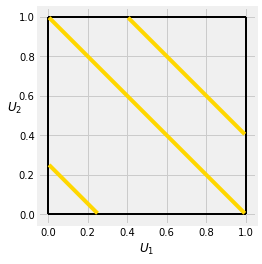
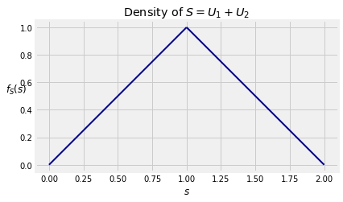

## The Convolution Formula

Let $X$ and $Y$ be discrete random variables and let $S = X+Y$. We know that a good way to find the distribution of $S$ is to partition the event $\{ S = s\}$ according to values of $X$. That is,

$$
P(S = s) ~ = ~ \sum_{\text{all }x} P(X = x, Y = s-x)
$$

If $X$ and $Y$ are independent, this becomes the *discrete convolution formula*:

$$
P(S = s) ~ = ~ \sum_{\text{all }x} P(X = x)P(Y = s-x)
$$

This formula has a straightforward continuous analog. Let $X$ and $Y$ be continuous random variables with joint density $f$, and let $S = X+Y$. Then the density of $S$ is given by

$$
f_S(s) ~ = ~ \int_{-\infty}^\infty f(x, s-x)dx
$$

which becomes the *convolution formula* when $X$ and $Y$ are independent:

$$
f_S(s) ~ = ~ \int_{-\infty}^\infty f_X(x)f_Y(s-x)dx
$$

### Sum of Two IID Exponential Random Variables
Let $X$ and $Y$ be i.i.d. exponential $(\lambda)$ random variables and let $S = X+Y$. For the sum to be $s > 0$, neither $X$ nor $Y$ can exceed $s$. The convolution formula says that the density of $S$ is given by

$$
\begin{align*}
f_S(s) ~ &= ~ \int_0^s \lambda e^{-\lambda x} \lambda e^{-\lambda(s-x)} dx \\ \\
&= ~ \lambda^2 e^{-\lambda s} \int_0^s dx \\ \\
&=~  \lambda^2 s e^{-\lambda s}
\end{align*}
$$

That's the gamma $(2, \lambda)$ density, consistent with the claim made in the previous chapter about sums of independent gamma random variables.

Sometimes, the density of a sum can be found without the convolution formula.

### Sum of Two IID Uniform $(0, 1)$ Random Variables
Let $S = U_1 + U_2$ where the $U_i$'s are i.i.d. uniform on $(0, 1)$. The gold stripes in the graph below show the events $\{ S \in ds \}$ for various values of $S$.

The joint density surface is flat. So the shape of the density of $S$ depends only on the lengths of the stripes, which increase linearly between $s = 0$ and $s = 1$ and then decrease linearly between $s = 1$ and $s = 2$. So the joint density of $S$ is triangular. The height of the triangle is 1 since the area of the triangle has to be 1.

At the other end of the difficulty scale, the integral in the convolution formula can sometimes be quite intractable. In the rest of the chapter we will develop a different way of deriving distributions of sums.
