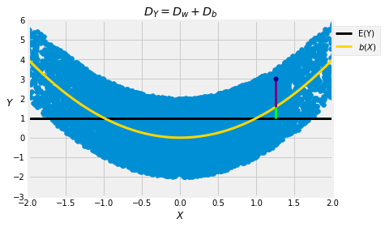

## Variance by Conditioning

Iteration allows us to find expectation by conditioning. We now have the tools to find variance by conditioning as well.

Recall the notation of the previous section:
- $X$ and $Y$ are jointly distributed random variables
- $b(X) = E(Y \mid X)$
- $D_w = Y - b(X)$

Define $D_Y = Y - E(Y)$. Then

$$
D_Y ~ = ~  D_w + (b(X) - E(Y)) ~ = ~ D_w + D_b
$$

where $D_b = b(X) - E(Y)$ is the deviation of the random variable $b(X)$ from its expectation $E(Y)$.

In the graph below, the black line is at the level $E(Y)$, and the dark blue point is a generic point $(X, Y)$ in the scatter plot. Its distance from the black line is $D_Y$ and is equal to the sum of two lengths:
- $D_w$, the length of the purple segment
- $D_b$, the length of the green segment

### Decomposition of Variance
The expectation $E(Y)$ is a constant. That means $D_b = b(X) - E(Y)$ is a function of $X$ and hence is uncorrelated with $D_w$. Because $D_Y = D_w + D_b$, we have a *decomposition of variance*:

$$
Var(D_Y) ~ = ~ Var(D_w) + Var(D_b)
$$

Let's take a closer look at these three variances. Shifting a random variable by a constant doesn't affect variance. So:
- $Var(D_Y) = Var(Y - E(Y)) = Var(Y)$
- $Var(D_b) = Var(b(X) - E(Y)) = Var(b(X))$, the *variance of the conditional expectation*.

Finally, because $E(D_w) = 0$,
$$
\begin{align*}
Var(D_w) ~ &= ~ E(D_w^2) \\
&= ~ E\big{(} (Y - b(X))^2 \big{)} \\
&= ~ E\big{(} E\big{(} (Y - b(X))^2 \mid X \big{)} \big{)}
\end{align*}
$$

Because $b(X) = E(Y \mid X)$, the random variable $E\big{(} (Y - b(X))^2 \mid X \big{)}$ is a function of $X$ called the *conditional variance of $Y$ given $X$* and denoted $Var(Y \mid X)$. Its value at $x$ is $Var(Y \mid X=x)$, that is, the variance of the values of $Y$ in the vertical strip at $x$.

So $Var(D_w) = E(Var(Y \mid X))$ is the *expectation of the conditional variance*.

Because of these observations, the variance decomposition above is more commonly written as a decomposition of the variance of $Y$:

$$
Var(Y) ~ = ~ E(Var(Y \mid X)) + Var(E(Y \mid X))
$$

That is, **the variance is equal to the expectation of the conditional variance plus the variance of the conditional expectation**.

It makes sense that the two quantities on the right hand side are involved in the calculation of $Var(Y)$. The variability of $Y$ has two components:
- the rough size of the variability within the individual vertical strips, that is, the expectation of the conditional variance
- the variability between strips, measured by the variance of the centers of the strips.

The variance decomposition show that you can just add the two terms to get $Var(Y)$.

This decomposition is the basis of *analysis of variance* (ANOVA), widely used in statistics. In this course we are going to use it to find variances by conditioning.
